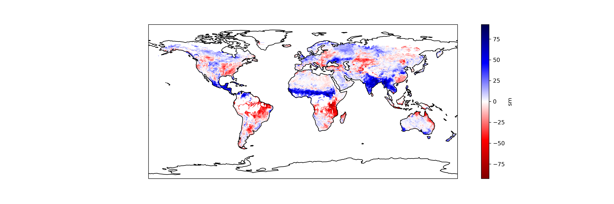

# Geodatenanalyse 1

## Ein Modul für die Vertiefung des Profils Hydro- und Ingenieurgeologie
## Studiengang <a href="https://www.agw.kit.edu/9269.php" target="_blank">Angewandte Geowissenschaften M.Sc.</a> am Karlsruher Institut für Technologie (KIT)

Für allgemeine Kursinformationen siehe [KIT Campus Management für Studierende](https://campus.studium.kit.edu/ev/AZwVrKlTRJWesOLkhZyxMQ/de)

Für detaillierte Kursinformationen siehe [KIT ILIAS](https://ilias.studium.kit.edu/goto.php?target=crs_1262934&client_id=produktiv)
